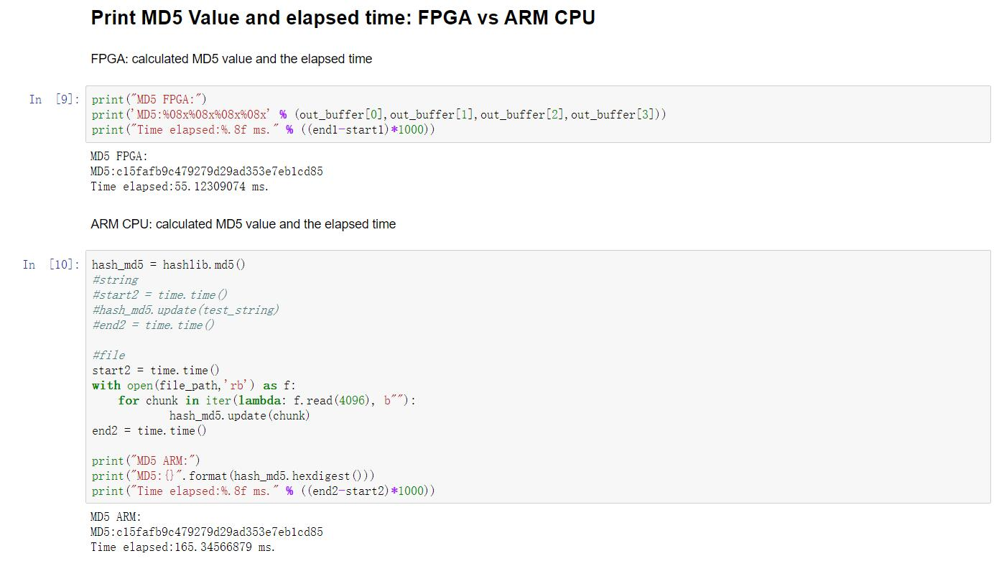

# HLS-MD5

 

README: [English](https://github.com/Gatsby253/HLS-MD5/blob/master/README.md) | [中文](https://github.com/Gatsby253/HLS-MD5/blob/master/README-zh.md)

**这是2020年新工科联盟-Xilinx暑期学校的项目，小组由3人组成。**

HLS-MD5使用Vivado HLS在FPGA上实现了MD5算法。HLS-MD5包含两个独立的部分MD5_PYNQ和MD5_SDK。MD5_PYNQ和MD5_SDK均为MD5算法在FPGA上的实现。
## MD5_PYNQ
MD5_PYNQ使用HLS在PL中实现MD5算法，使用PYNQ框架中的Jupyter (Python3)实现PS部分的工作。输入的数据存放在Memory中，然后通过AXIS和DMA传入到PL。 
## MD5_SDK
MD5_SDK使用HLS在PL中实现MD5算法，使用SDK和C语言实现PS部分的工作。输入的数据直接存入BRAM中然后通过M_AXI传入到PL。MD5_SDK的运行不需要PYNQ框架。
## 测试平台
- Xilinx PYNQ-Z2 Board
- Vivado 2018.3
- Vivado HLS 2018.3
- PYNQ-Z2 Boot Image V2.4 

## 目录说明
*Sourcecode*: *Sourcecode*文件夹包含了项目的所有源代码。其中*MD5_PYNQ*文件夹和*MD5_SDK*文件夹分别包含了MD5_PYNQ和MD5_SDK的源代码。源代码包含HLS C/C++源文件、MD5_PYNQ的Jupyter文件、MD5_SDK的SDK C代码。这个文件夹中还有Vivado Block Design的tcl文件和一些测试数据。

*ExecutableFiles*: *ExecutableFiles*文件夹包含了*MD5_PYNQ*文件夹和*MD5_SDK*文件夹。*MD5_PYNQ*文件夹包含`.bit`, `.hwh`以及`.tcl`文件用于Jupyter。*MD5_SDK*文件夹包含了`.bit`文件以及SDK的`.elf`文件。

## 示例
- MD5_PYNQ input file: *Sourcecode/MD5_PYNQ/testdata/testdata1* 

- MD5_SDK input string: The first line in *Sourcecode/MD5_SDK/testdata/testdata* 

