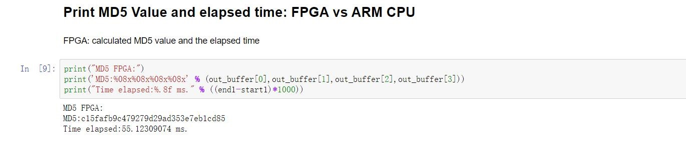
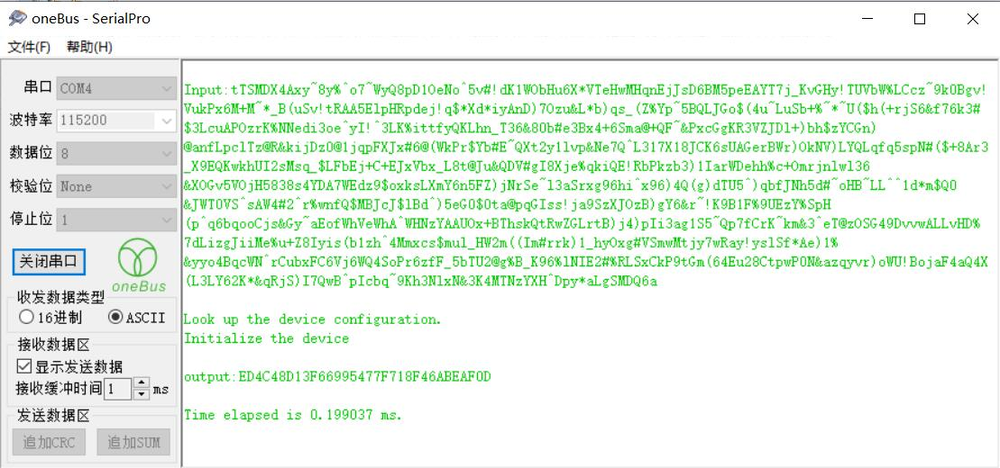

HLS-MD5
=======
This is the repository for HLS-MD5, which is a 2020 Xilinx Summmer School (2020年新工科联盟-Xilinx暑期学校) project. The team is made up of 3 members. 

HLS-MD5 implements MD5 algorithm on FPGA using Vivado HLS. The porject contains two independent parts: MD5_PYNQ and MD5_SDK. Both MD5_PYNQ and MD5_SDK are implementations of MD5 algorithm on FPGA.

这是2020年新工科联盟-Xilinx暑期学校的项目，小组由3人组成。

HLS-MD5可以使用Vivado HLS在FPGA上实现了MD5算法。项目HLS-MD5包含两个独立的部分MD5_PYNQ和MD5_SDK。MD5_PYNQ和MD5_SDK均为MD5算法在FPGA上的实现。
## MD5-PYNQ
In MD5_PYNQ we utilize HLS to implement MD5 algorithm in PL, and utilize Jupyter (Python3) in PS based on the PYNQ framework. The input data is stored in Memory and then transferred to PL using AXIS and DMA.

MD5_PYNQ使用HLS实现PL部分，使用基于PYNQ框架中的Jupyter (Python3)编写PS部分。输入的数据存放在Memory中，然后通过AXIS和DMA传入到PL。 
## MD5-SDK
In MD5_SDK we utilize HLS to implement MD5 algorithm in PL and utilize Xilinx SDK (C Language) in PS. The input data is directly stored in BRAM and then transferred to PL using M-AXI. MD5_SDK does not need a PYNQ framework to run.

MD5_SDK使用HLS实现PL部分，使用SDK和C语言编写PS部分。输入的数据直接存入BRAM中然后通过M-AXI传入到PL。MD5_SDK的运行不需要PYNQ框架。
## Platform
- Xilinx PYNQ-Z2 Board
- Vivado 2018.3
- Vivado HLS 2018.3
- PYNQ-Z2 Boot Image V2.4 

## Contents
*Sourcecode*: *Sourcecode* contains the source code of the project. MD5_PYNQ folder contains the source code of MD5_PYNQ and MD5_SDK folder contains the sourcc code of MD5_SDK. The source files include the HLS C/C++ source code, the Jupyter Python3 code for MD5_PYNQ and the SDK C code for MD5_SDK. *Sourcecode* also contains the Vivado Block Design .tcl file and some test data.

*ExecutableFiles*: *Executablefiles* contains two folders MD5_PYNQ and MD5_SDK. MD5_PYNQ contains the .bit, .hwh and .tcl file for Jupyter. MD5_SDK contains the .bit file and the SDK .elf file.

*sourcecode*: *sourcecode*文件夹包含了项目的所有源代码。其中MD5_PYNQ文件夹和MD5_SDK文件夹分别包含了MD5_PYNQ和MD5_SDK的源代码。源代码包含HLS C/C++源文件、MD5_PYNQ的Jupyter的Python3代码、MD5_SDK的SDK C代码。这个文件夹中还有Vivado Block Design的tcl文件和一些测试数据。

*ExecutableFiles*: *Executablefiles* 文件夹包含了MD5_PYNQ文件夹和MD5_SDK文件夹。MD5_PYNQ文件夹包含.bit, .hwh以及.tcl文件用于Jupyter。MD5_SDK文件夹包含了.bit文件以及SDK的.elf文件。

## Examples
MD5_PYNQ input data: *testdata1* 

MD5_SDK input data: The first line in *testdata* 

